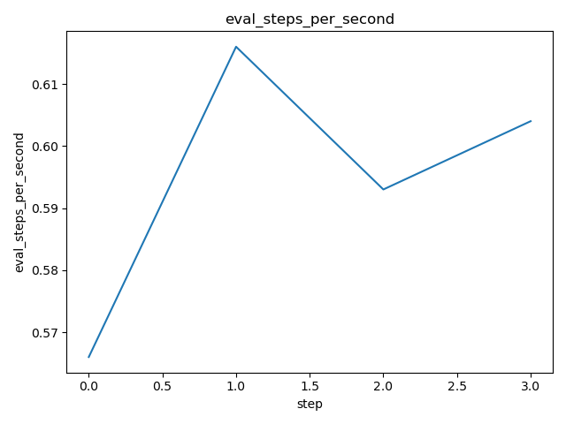
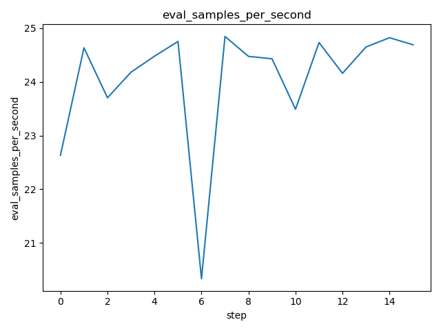
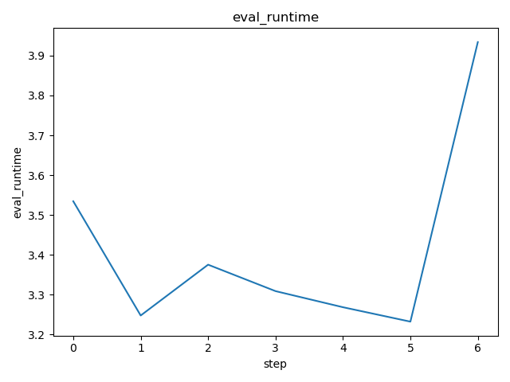
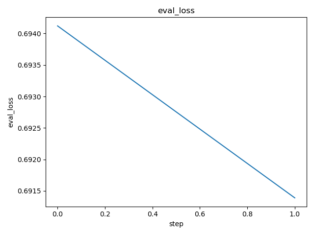
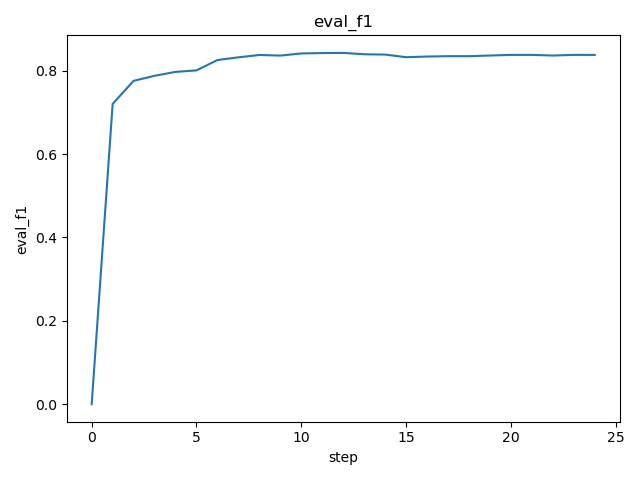
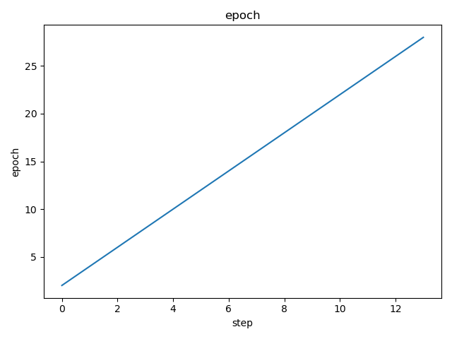
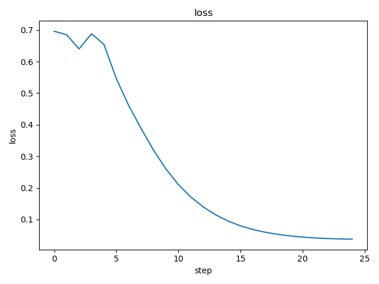
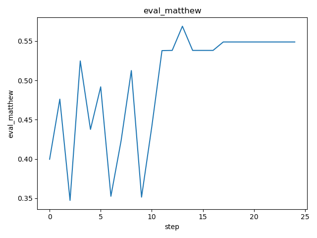
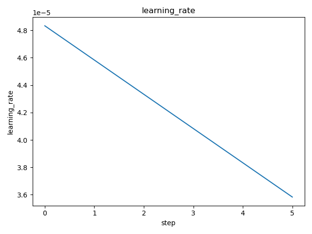
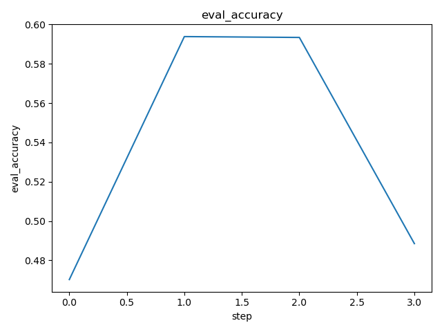

# DVC Report

metrics.json

|   loss |   learning_rate |   epoch |   eval_loss |   eval_f1 |   eval_accuracy |   eval_matthew |   eval_runtime |   eval_samples_per_second |   eval_steps_per_second |   step |
|--------|-----------------|---------|-------------|-----------|-----------------|----------------|----------------|---------------------------|-------------------------|--------|
| 0.2223 |     6.17284e-07 |    0.98 |    0.221578 |  0.906475 |        0.909327 |       0.818592 |        131.862 |                   136.999 |                   1.714 |      9 |

