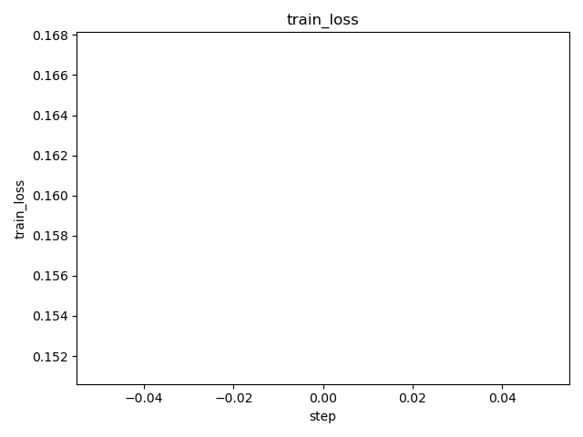
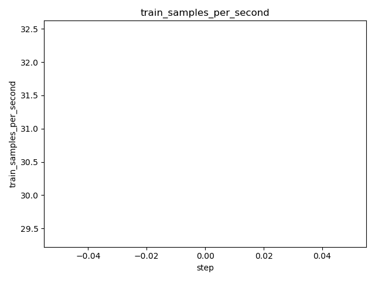
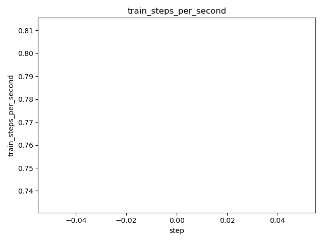

# DVC Report

metrics.json

|   loss |   learning_rate |   epoch |   train_runtime |   train_samples_per_second |   train_steps_per_second |   total_flos |   train_loss |
|--------|-----------------|---------|-----------------|----------------------------|--------------------------|--------------|--------------|
| 0.0167 |               0 |      50 |         64.6768 |                     30.923 |                    0.773 |  2.32821e+15 |     0.159374 |

