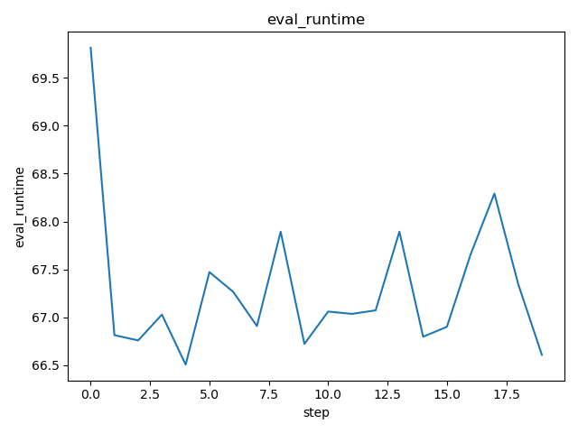
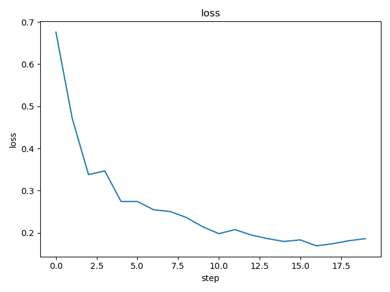

# DVC Report

metrics.json

|   loss |   learning_rate |   epoch |   eval_loss |   eval_f1 |   eval_accuracy |   eval_matthew |   eval_runtime |   eval_samples_per_second |   eval_steps_per_second |   step |
|--------|-----------------|---------|-------------|-----------|-----------------|----------------|----------------|---------------------------|-------------------------|--------|
| 0.0598 |         3.8e-05 |      12 |    0.629098 |  0.816327 |           0.775 |       0.615882 |         3.2323 |                     24.75 |                   0.619 |      5 |

