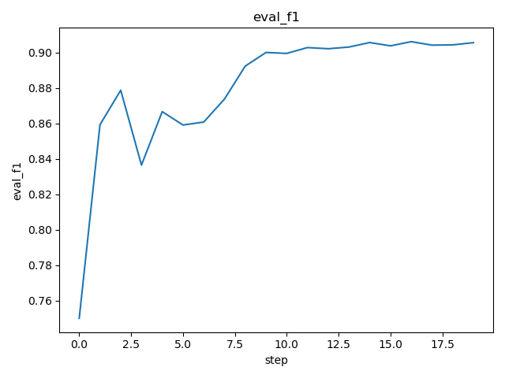
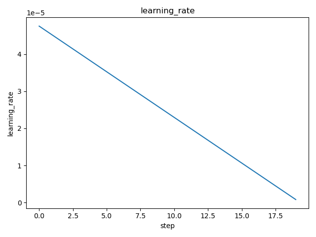

# DVC Report

metrics.json

|   loss |   learning_rate |   epoch |   eval_loss |   eval_f1 |   eval_accuracy |   eval_matthew |   eval_runtime |   eval_samples_per_second |   eval_steps_per_second |   step |
|--------|-----------------|---------|-------------|-----------|-----------------|----------------|----------------|---------------------------|-------------------------|--------|
| 0.6935 |     4.33333e-05 |     0.3 |    0.689075 |  0.661304 |        0.593405 |       0.236571 |        75.5342 |                    426.35 |                   2.224 |      2 |

