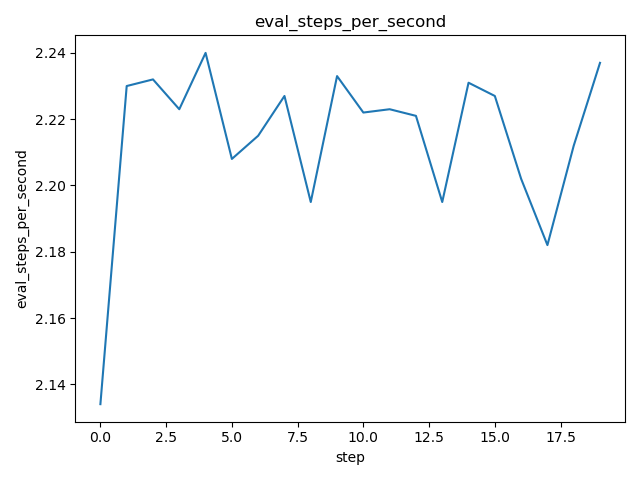
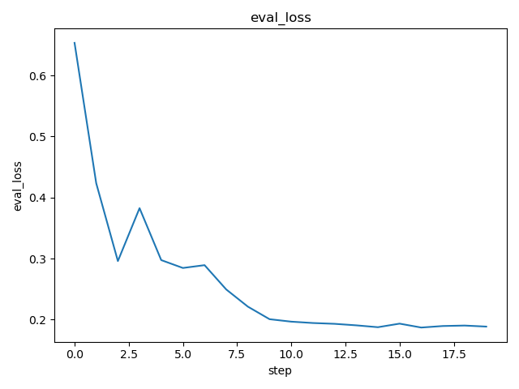
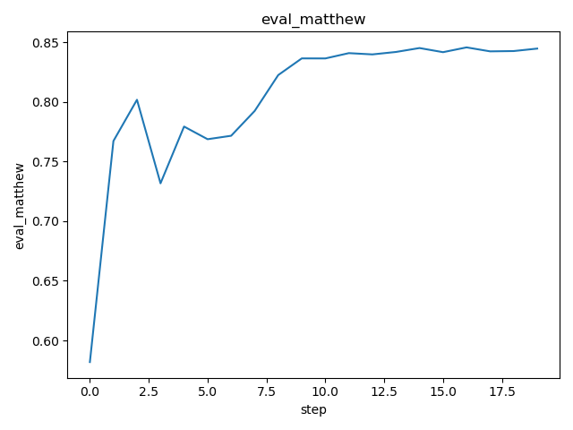
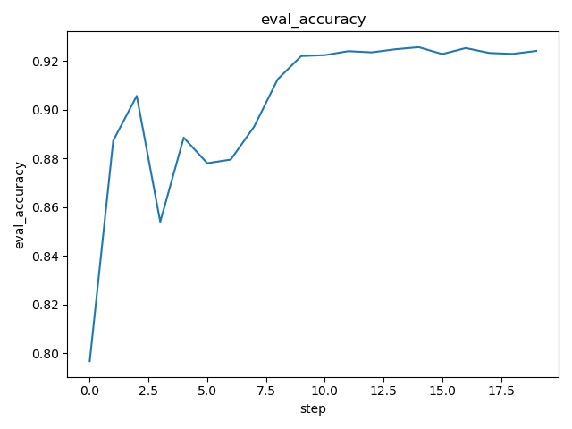

# DVC Report

metrics.json

|   loss |   learning_rate |   epoch |   eval_loss |   eval_f1 |   eval_accuracy |   eval_matthew |   eval_runtime |   eval_samples_per_second |   eval_steps_per_second |   step |
|--------|-----------------|---------|-------------|-----------|-----------------|----------------|----------------|---------------------------|-------------------------|--------|
| 0.0302 |               0 |      50 |    0.668866 |  0.837766 |        0.809375 |       0.645878 |         7.3686 |                    86.855 |                   2.171 |     24 |

